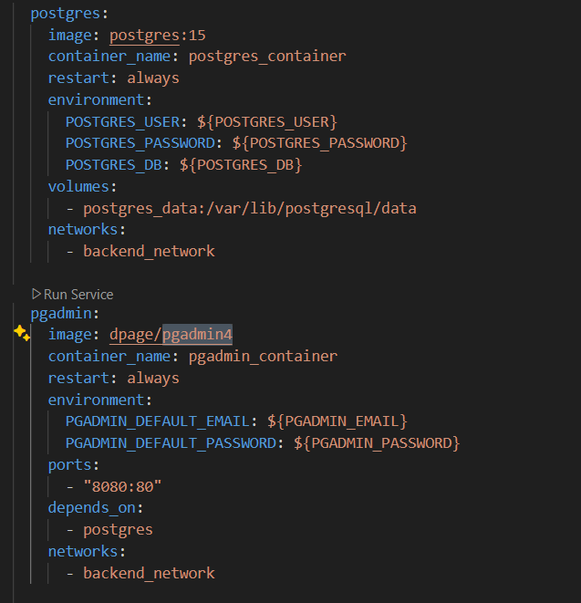

# Practica servidor web
## 1. Titulo
Despliege de Backend
## 2. Tiempo de duración
8 horas 
## 3. Fundamentos:
 Servicio de Base de Datos El uso de contenedores para servicios de base de datos permite desplegar motores como PostgreSQL o MySQL en entornos aislados, facilitando la configuración, escalabilidad y pruebas reproducibles, sin afectar la instalación del sistema anfitrión

Construcción de Artefactos: en lenguajes compilados se refiere al proceso de traducir el código fuente a ejecutables o archivos intermedios (.jar, .exe, .dll), que representan el producto final que será desplegado o distribuido (Bass, Clements & Kazman, 2012).

Creación de Imágenes Docker: La creación de imágenes Docker consiste en definir un entorno de ejecución a partir de un archivo Dockerfile, que especifica una secuencia de instrucciones para construir una imagen autocontenida con la aplicación, librerías y sistema base requerido (Turnbull, 2014).

Orquestación con Docker Compose: Docker Compose es una herramienta para definir y gestionar múltiples contenedores mediante archivos YAML, permitiendo levantar entornos completos (bases de datos, servicios web, frontend, etc.) con una sola instrucción (Whiteley, 2017).

Manejo de variables ambiente: El manejo de variables de ambiente permite configurar aplicaciones y servicios sin modificar el código fuente. Es fundamental para inyectar configuraciones sensibles, como credenciales o rutas, de forma segura y desacoplada del repositorio del código (Fowler, 2010). 

## 4. Conocimientos previos.
   
Para realizar esta practica el estudiante necesita tener claro los siguientes temas:
- Contenedores.
- Puerto de salida.
- Ip.
- Documento docker-compose.yml

## 5. Objetivos a alcanzar

- Configurar contenedores Docker para servicios de base de datos,
- Diseñar un contenedor de construcción que compile la aplicación y genere el artefacto ejecutable
- Crear y optimizar archivos Dockerfile para generar imágenes eficientes
- Definir y estructurar archivos docker-compose.yml para orquestar el despliegue de una aplicación backend
## 6. Equipo necesario:
  
- Computador con sistema operativo Windows/Linux
- Plataforma Docker playground o desktop
- Docker hub

## 7. Material de apoyo.
   
- Documentacion de tendencias tecnologicas.
- Docker desktop
- Videos ilustrativos
- Documentacion sobre la configuracion del documento para el despliege de backend.
  
## 8. Procedimiento
Paso 1:Crear la base de datos posrgres y pgadmin con los volumnes y redes correspondientes
 

paso 7: Verificar que pgAdmin pueda conectarse a PostgreSQL correctamente.

paso 11: Asegurar que la aplicación se conecte correctamente a la base de datos PostgreSQL. 

paso 12: Definir las variables de entorno necesarias en un archivo .env.
 

 paso 14: Implementar una versión del Dockerfile que use esta técnica para reducir el tamaño de la imagen final y mejorar el proceso de automatización.
 

## 9. Resultados esperados:
    
Despues de esta práctica podemos concluir que toda la configuracon de todas dependencias que requiera mi aplicacion la puedo colocar dentro de un mismo archivo, en este caso el archivo docker-compose.yml donde realizamos toda la configuracon de los volumnes, variables de entorno, red, etc, tambien para la creacion de Dockerfile donde configuramos con maven. 

## 10. Bibliografía
    Fowler, M. (2010). Patterns of Enterprise Application Architecture. Addison-Wesley.

    Whiteley, K. (2017). Using Docker: Developing and Deploying Software with Containers. O’Reilly Media.

    Turnbull, J. (2014). The Docker Book: Containerization is the new virtualization. https://www.dockerbook.com

    Bass, L., Clements, P., & Kazman, R. (2012). Software architecture in practice (3rd ed.). Addison-Wesley.

audio:

<audio controls>
  <source src="media/nota.ogg" type="audio/ogg">
 
</audio>
